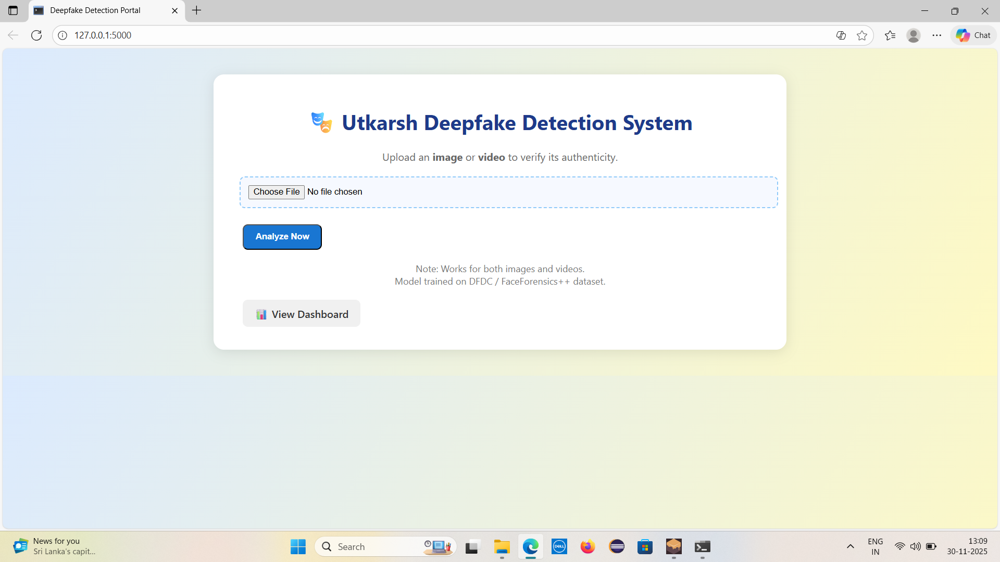
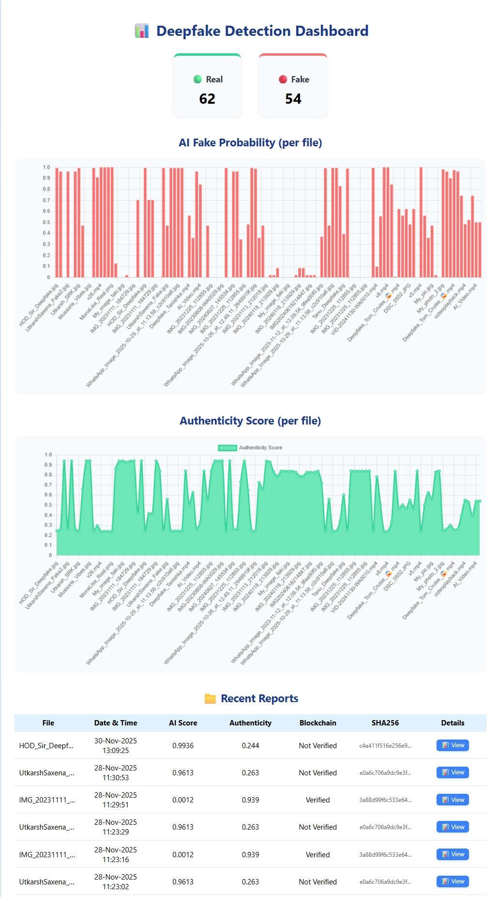
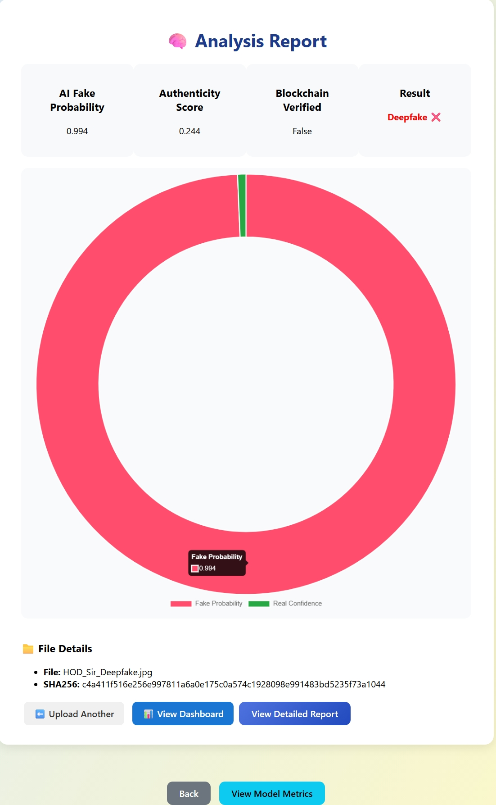

# 🚀 Blockchain and Deep Learning-Based Multi-Factor Framework for Real-Time Deepfake Detection

A Final Year B.Tech Project that combines **Deep Learning** and **Blockchain Technology** for **real-time deepfake detection** and **tamper-proof media verification**.

---

## 🆔 Group Details

**Group Number:** P15  
**Supervisor:** Dr. Pradeep Kumar *(Assistant Professor, MIT)*  
**Group Leader:** Utkarsh Saxena *(CSE)*

### 👥 Team Members

| Name | Department |
|-------|------------|
| Utkarsh Saxena | CSE |
| Tanishka Ruhela | CSE |
| Ujjwal Mishra | CSE |
| Manisha Kashyap | CSE |

---

## 📖 Abstract

With the rapid rise of deepfake technologies, the authenticity of digital media is under serious threat. Fake videos and manipulated content are increasingly used for misinformation, political manipulation, identity theft, and cybercrimes.

Traditional detection techniques often fail against highly realistic deepfakes. To address this challenge, this project proposes a **multi-factor, real-time deepfake detection framework** that combines:

- 🧠 **Deep Learning (CNN Models)** for manipulated content detection  
- 🔗 **Blockchain Technology** for secure and tamper-proof verification  
- 🌐 **Web-Based Platform** for user interaction and real-time analysis  

This integrated approach ensures **robust, transparent, and scalable detection**, making it suitable for applications such as **social media moderation, journalism verification, and digital forensics**.

---

## 🚀 Features

✅ Deepfake Detection using CNN models *(XceptionNet / EfficientNet)*  
✅ Blockchain-based content verification  
✅ Multi-factor decision system for higher accuracy  
✅ Real-time prediction via web interface  
✅ Tamper-proof authenticity validation  

---

## 🛠️ Tech Stack

| Technology | Tools Used |
|------------|-------------|
| Frontend | HTML, CSS, JavaScript |
| Backend | Flask (Python) |
| Deep Learning | TensorFlow / Keras |
| Blockchain | Ethereum (Ganache), Web3.py |
| Libraries | OpenCV, NumPy, Pandas |

---

## ⚙️ Methodology

### 1️⃣ Data Preparation & Model Training
Datasets Used:
- FaceForensics++
- DFDC

CNN Models:
- XceptionNet
- EfficientNet

### 2️⃣ Blockchain Verification Layer
- Generate **SHA-256 hash** of videos/images  
- Store hash on **Ethereum blockchain**  
- Use **smart contracts** for validation  

### 3️⃣ Multi-Factor Decision Module
Combine:
- AI prediction score  
- Blockchain verification  
- Metadata analysis  

Generate final authenticity score.

### 4️⃣ Web Platform
Developed using **Flask**.

Users can:
- Upload media  
- Get real/fake prediction  
- View blockchain verification  

---

## 📂 Project Structure

```txt
P15_DeepfakeDetection_FinalYearProject/
│── app/
│── notebooks/
│── reports/
│── screenshots/
│── training.py
│── requirements.txt
│── README.md
│── .gitignore
```

## 📸 Screenshots

### Home Page


### Deepfake Detection Result


### Blockchain Verification


---

## 🎥 Demo Video

📺 Watch the Project Demonstration Here:

[▶️ Watch Demo Video](YOUR_YOUTUBE_LINK)

---

## ⚙️ Installation & Setup

### 1️⃣ Create Virtual Environment

```bash
python -m venv venv
```

### 2️⃣ Activate Environment

**Windows**
```bash
venv\Scripts\activate
```

**Linux / Mac**
```bash
source venv/bin/activate
```

### 3️⃣ Install Dependencies

```bash
pip install -r requirements.txt
```

### 🧠 Model Training *(Optional)*

```bash
python training.py
```

> ⚠️ For better accuracy, use large datasets like **FaceForensics++** or **DFDC**.

---

## 🔗 Blockchain Setup

### Start Ganache

```txt
http://127.0.0.1:7545
```

### Deploy Smart Contract

```bash
python app/blockchain/deploy_contract.py
```

---

## ▶️ Run the Application

```bash
python app/app.py
```

Open in browser:

```txt
http://127.0.0.1:5000
```

---

## 🧪 Working Flow

1️⃣ User uploads **video/image**  

2️⃣ Model predicts whether media is **Real or Fake**  

3️⃣ SHA-256 hash generated and verified through **Blockchain**  

4️⃣ Multi-factor system calculates the **final authenticity score**  

5️⃣ Final result displayed to the user  

---

## 🎯 Applications

- 📱 Social Media Content Moderation  
- 📰 News & Journalism Verification  
- 🕵️ Digital Forensics  
- 🔐 Cybercrime Prevention  

---

## ⚠️ Notes

- Pretrained model included for demo purposes  
- Retraining recommended for better accuracy  
- Blockchain module can be used optionally for demonstration  

---

## 🔮 Future Scope

- 🎥 Live Video Streaming Detection  
- 📱 Mobile Application Integration  
- 🤖 Advanced AI Models *(GAN Detection)*  
- ☁️ Cloud Deployment  

---

## 🧠 Model & Notebook

The project includes the **training and experimentation notebook** inside the `notebooks/` folder.

```txt
notebooks/
└── Utkarsh_DEEPFAKE.ipynb
```

The notebook contains:
- Data preprocessing  
- Model training workflow  
- Deepfake detection experimentation  
- Evaluation process  

> ⚠️ Due to GitHub file size limitations, the trained `.h5` model file is not included in this repository.

---

## 📜 License

This project is intended for **academic and educational use only**.
